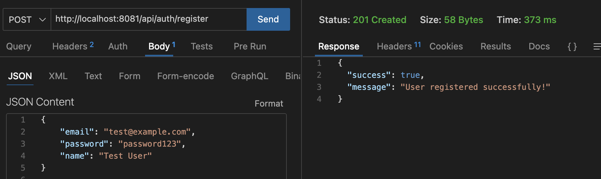
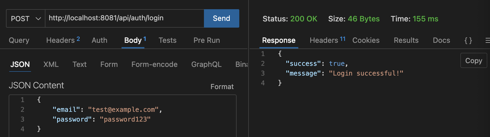

# Blind

### URLs

- 회원가입 (/api/register)  
    
    
    
- 로그인 (/api/)

    

## A. UserRepository

### findByEmail(String email)
이메일로 사용자를 찾습니다.
- 이메일을 기준으로 사용자를 조회하는 기능을 제공
- User 엔티티의 email 필드를 기준으로 검색하는 SQL쿼리를 자동으로 생성
- 예시 쿼리: SELECT * FROM User WHERE email = ? 

### findByNameContaining(String keyword)
이름에 주어진 키워드를 포함하는 사용자를 찾는다.
- 이 메소드는 이름(name)속성에 특정 키워드가 포함된 사용자를 조회
-  findBy 뒤에 오는 NameContaining을 해석하여 name 필드에 주어진 키워드가 포함된 사용자를 찾는 SQL LIKE 쿼리를 생성합니다.
- 예시 쿼리: SELECT * FROM User WHERE name LIKE '%keyword%'

# 3. Service 클래스 생성

- 서비스 계층에서 비즈니스 로직을 구현
- 예를들어 사용자를 조회, 저장, 수정, 삭제하는 기능을 구현

## A. UserService

- Generate 기능을 이용해서 getter, setter를 생성
- `isPresent()` 메소드는 Optional 객체에 값이 존재하는지 여부를 확인하는 메소드이므로 변환 타입이 `Optional<T>`이어야합니다.

### 4. Controller 작성

- 컨트롤러는 클라이언트로부터 요청을 받아 처리

- REST API를 적용하기 위해 `@Controller` 대신에 `@RestController`를 사용하고, 반환값을 JSON 형식으로 반환

